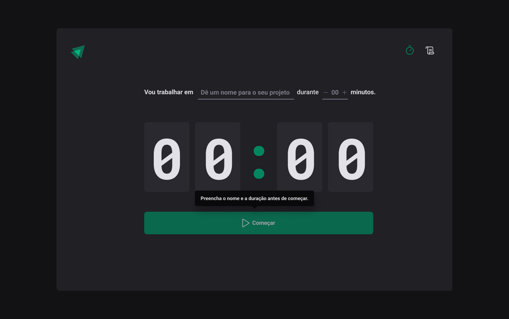
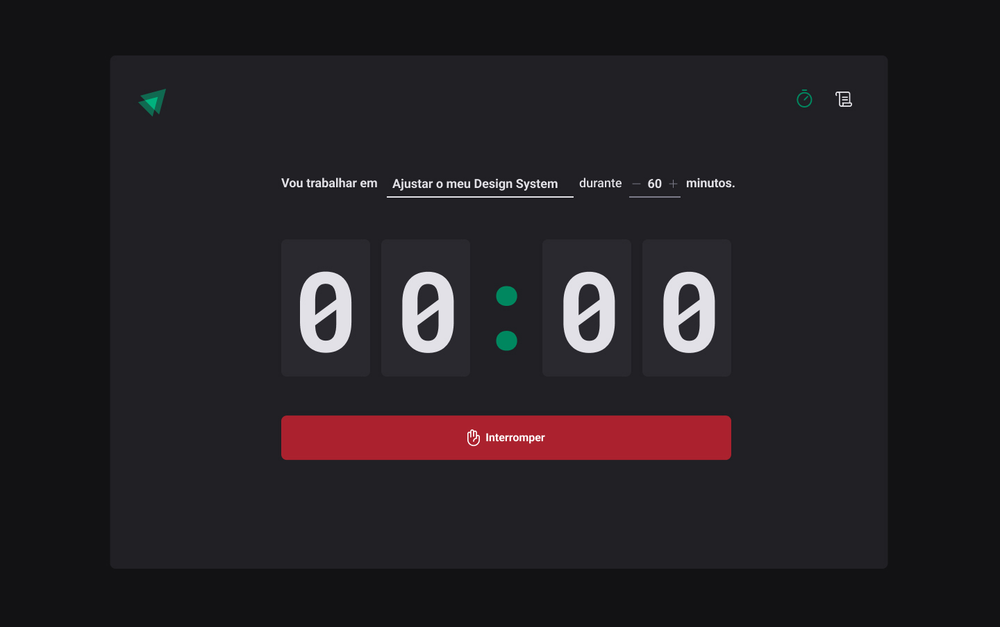
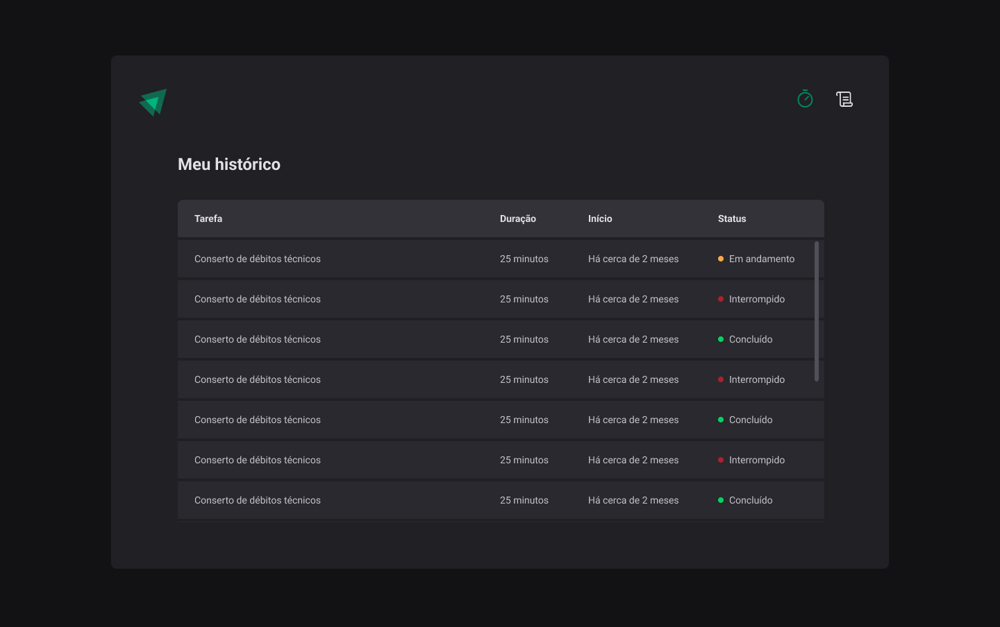
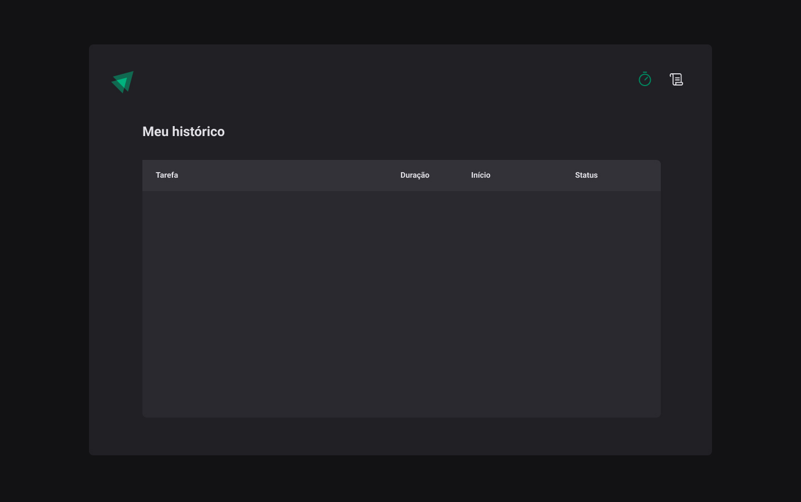

<h1 align="center"> Ignite Timer </h1>

  

 

  

  

  

  

## 🚀 Tecnologias

Esse projeto está sendo desenvolvido com as seguintes tecnologias:

- Git e Github
- Figma
- Nodejs
- React
- Typescript

## 💻 Projeto

Projeto desenvolvido em cima do Pomodoro A técnica consiste na utilização de um cronômetro para dividir o trabalho em períodos de 25 minutos, separados por breves intervalos.